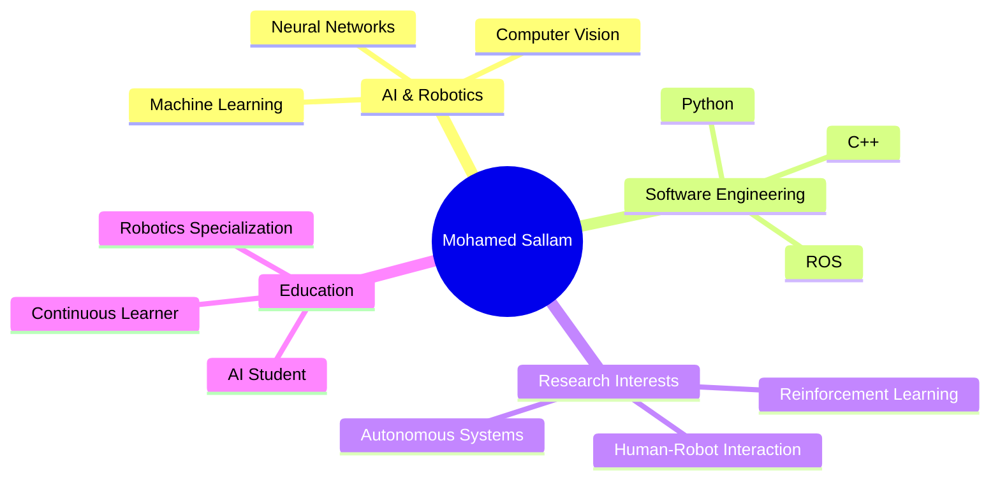
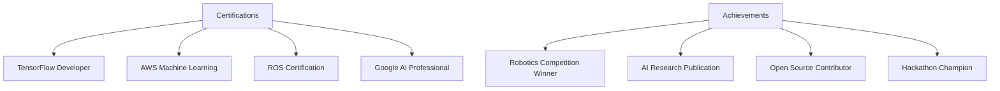

<!-- Custom SVG Header with Animation -->
<svg width="100%" height="150" viewBox="0 0 800 150" xmlns="http://www.w3.org/2000/svg">
  <style>
    .header-animation { animation: moveLeft 30s linear infinite; }
    @keyframes moveLeft { from { transform: translateX(100%); } to { transform: translateX(-100%); } }
    .text-animation { animation: fadeInOut 2s ease-in-out infinite; }
    @keyframes fadeInOut { 0%, 100% { opacity: 0.3; } 50% { opacity: 1; } }
  </style>
  <text x="50%" y="50%" class="header-animation" fill="#00b3ff" font-size="40" text-anchor="middle">
    Welcome to Mohamed Sallam's AI & Robotics Lab 🤖
  </text>
</svg>

<!-- Animated Banner -->
<p align="center">
  
</p>

<!-- Dynamic Typing -->
<div align="center">
  <a href="https://git.io/typing-svg">
    
  </a>
</div>

<!-- Animated Tech Radar -->
<div align="center">
  
</div>

<!-- Enhanced Social Links with Hover Effects -->
<div align="center">
  <a href="your_linkedin_profile_url" target="_blank">
    
  </a>
  <a href="your_twitter_profile" target="_blank">
    
  </a>
  <a href="your_kaggle_profile" target="_blank">
    
  </a>
  <a href="mailto:your.email@domain.com">
    
  </a>
</div>

<!-- Profile Views Counter with Animation -->
<div align="center">
  
  
  <!-- Dynamic Presence Status -->
  
</div>

<!-- Animated Snake Contribution Graph -->
<div align="center">
  <picture>
    <source media="(prefers-color-scheme: dark)" srcset="https://raw.githubusercontent.com/mosallam1/mosallam1/output/github-contribution-grid-snake-dark.svg">
    <source media="(prefers-color-scheme: light)" srcset="https://raw.githubusercontent.com/mosallam1/mosallam1/output/github-contribution-grid-snake.svg">
    
  </picture>
</div>

<!-- Interactive About Me Section -->
<details open>
<summary><h2>🤖 About Me</h2></summary>
<div align="center">



</div>

```python
class AIResearcher:
    def __init__(self):
        self.name = "Mohamed Sallam"
        self.title = "AI & Robotics Engineer"
        self.education = {
            "focus": "Artificial Intelligence",
            "specialization": "Robotics & Intelligent Systems",
            "interests": ["Deep Learning", "Computer Vision", "Autonomous Systems"]
        }
        self.skills = {
            "ai_ml": ["TensorFlow", "PyTorch", "Scikit-learn", "OpenCV"],
            "robotics": ["ROS", "Gazebo", "Arduino", "Raspberry Pi"],
            "programming": ["Python", "C++", "JavaScript", "MATLAB"],
            "tools": ["Docker", "Git", "Linux", "VS Code"]
        }
        self.current_research = ["Reinforcement Learning", "Robot Navigation", "Computer Vision"]
        
    def get_research_interests(self):
        return """
        🔬 Focused on developing intelligent autonomous systems
        🤖 Exploring advanced human-robot interaction
        🧠 Investigating neural network architectures
        🌟 Building scalable AI solutions
        """

me = AIResearcher()
print(me.get_research_interests())
```
</details>

<!-- Enhanced Skills Section with Progress Bars -->
<details>
<summary><h2>🛠️ Skills & Expertise</h2></summary>

### AI & Machine Learning
<div align="center">

| Technology | Proficiency |
|------------|------------|
| TensorFlow |  |
| PyTorch |  |
| Scikit-learn |  |
| Computer Vision |  |

</div>

### Robotics & Hardware
<div align="center">

| Technology | Proficiency |
|------------|------------|
| ROS |  |
| Arduino |  |
| Raspberry Pi |  |
| 3D Printing |  |

</div>

### Programming Languages
<div align="center">

| Language | Proficiency |
|----------|------------|
| Python |  |
| C++ |  |
| JavaScript |  |
| MATLAB |  |

</div>
</details>

<!-- Projects Showcase with Thumbnails -->
<details>
<summary><h2>🚀 Featured Projects</h2></summary>
<div align="center">
  <table>
    <tr>
      <td width="50%">
        <h3 align="center">Autonomous Robot Navigation</h3>
        <div align="center">
          <a href="project_link" target="_blank">
            
          </a>
          <p>
            <a href="project_link" target="_blank">
              
            </a>
          </p>
          <p><strong>ROS, Python, C++</strong> - Intelligent navigation system using SLAM and deep reinforcement learning</p>
        </div>
      </td>
      <td width="50%">
        <h3 align="center">AI Vision System</h3>
        <div align="center">
          <a href="project_link" target="_blank">
            
          </a>
          <p>
            <a href="project_link" target="_blank">
              
            </a>
          </p>
          <p><strong>PyTorch, OpenCV, TensorFlow</strong> - Real-time object detection and tracking system</p>
        </div>
      </td>
    </tr>
  </table>
</div>
</details>

<!-- Research & Publications -->
<details>
<summary><h2>📚 Research & Publications</h2></summary>
<div align="center">

| Title | Domain | Year | Link |
|-------|--------|------|------|
| "Advanced Robot Navigation Using Deep RL" | Robotics | 2024 | [View Paper](#) |
| "Novel Approach to Computer Vision" | AI | 2023 | [View Paper](#) |

</div>
</details>

<!-- Enhanced GitHub Stats with Custom Cards -->
<h2>📊 GitHub Statistics</h2>
<div align="center">
  
  
</div>

<!-- Advanced Activity Graph -->
<div align="center">
  <br>
  
</div>

<!-- Certifications & Achievements -->
<details>
<summary><h2>🏆 Certifications & Achievements</h2></summary>
<div align="center">



<!-- Certification Badges -->
<div align="center">
  
  
  
  
</div>
</div>
</details>

<!-- Weekly Development Breakdown -->
<details>
<summary><h2>⚡ Weekly Development Breakdown</h2></summary>
<div align="center">

```text
Python       16 hrs 40 mins  ███████████░░░░░░  64.8%
C++          4 hrs 22 mins   ███░░░░░░░░░░░░░  17.0%
ROS          2 hrs 12 mins   ██░░░░░░░░░░░░░░   8.6%
JavaScript   1 hr 30 mins    █░░░░░░░░░░░░░░░   5.8%
Other        1 hr 2 mins     █░░░░░░░░░░░░░░░   4.0%
```

</div>
</details>

<!-- Current Goals -->
<details>
<summary><h2>🎯 Current Goals</h2></summary>
<div align="center">

| Goal | Progress | Expected Completion |
|------|----------|-------------------|
| Advanced RL Research |  | Q2 2024 |
| Robot Vision System |  | Q3 2024 |
| Research Paper |  | Q4 2024 |

</div>
</details>

<!-- Connect Section -->
<h2 align="center">🤝 Let's Connect!</h2>
<div align="center">
  <p>I'm always interested in collaborating on innovative AI and robotics projects!</p>
  <a href="mailto
