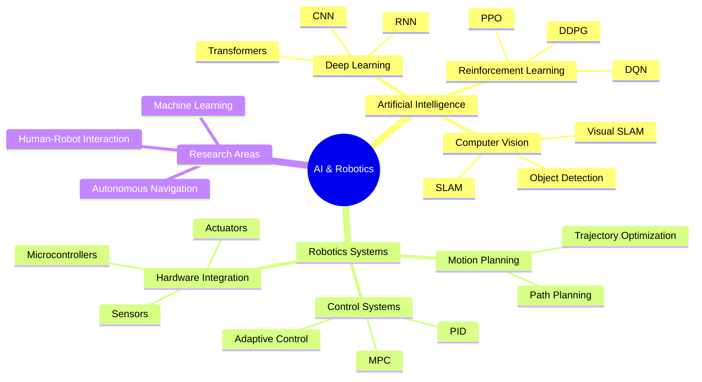
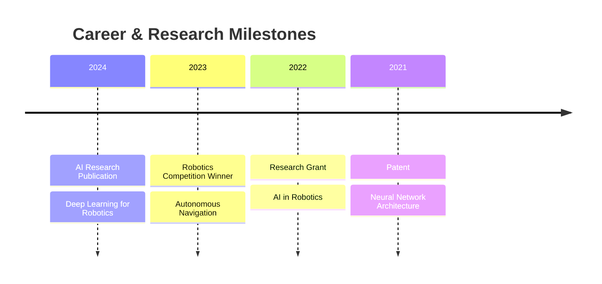
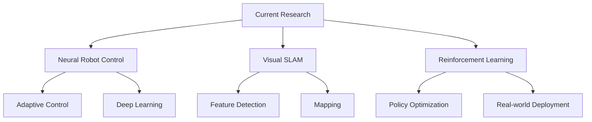

<!-- AI/Robotics-themed Header Animation -->
<div align="center">
  
</div>

<!-- Neural Network Animation Effect -->
<div align="center">
  
</div>

<!-- AI/ML Typing Effect -->
<div align="center">
  <a href="https://git.io/typing-svg">
    
  </a>
</div>

<!-- Professional Badges -->
<div align="center">
  <a href="your_linkedin_url">
    
  </a>
  <a href="your_github_url">
    
  </a>
  <a href="your_research_gate">
    
  </a>
</div>

<!-- AI/Robotics Tech Stack Animation -->
<div align="center">
  
</div>

<!-- Core Competencies Diagram -->


<!-- Technical Profile -->
<details open>
<summary><h2>🤖 Technical Profile</h2></summary>

```python
class RoboticsAIEngineer:
    def __init__(self):
        self.name = "Mohamed Sallam"
        self.role = "AI & Robotics Research Engineer"
        self.expertise = {
            "ai_systems": [
                "Deep Learning", "Computer Vision",
                "Reinforcement Learning", "Neural Networks"
            ],
            "robotics": [
                "Robot Operating System (ROS/ROS2)",
                "Motion Planning", "Control Systems",
                "SLAM", "Navigation"
            ],
            "programming": {
                "primary": ["Python", "C++", "CUDA"],
                "frameworks": ["TensorFlow", "PyTorch", "OpenCV"],
                "tools": ["ROS", "Gazebo", "Docker"]
            }
        }
        self.research_focus = [
            "Autonomous Systems",
            "Robot Learning",
            "Visual-Inertial Navigation"
        ]

    def get_research_statement(self):
        return """
        Focused on developing intelligent autonomous systems 
        that can learn, adapt, and interact safely with humans 
        in dynamic environments. Specialized in combining 
        deep learning with classical robotics approaches.
        """
```

</details>

<!-- AI & Robotics Skills Matrix -->
<details>
<summary><h2>🎯 Specialized Skills</h2></summary>
<div align="center">

### Artificial Intelligence & Machine Learning
| Technology | Expertise Level | Applications |
|------------|----------------|--------------|
| Deep Learning |  | Neural Architectures, Model Optimization |
| Computer Vision |  | Object Detection, SLAM, Visual Odometry |
| Reinforcement Learning |  | Robot Control, Policy Optimization |

### Robotics & Control Systems
| Technology | Expertise Level | Applications |
|------------|----------------|--------------|
| ROS/ROS2 |  | System Integration, Robot Control |
| Motion Planning |  | Path Planning, Trajectory Optimization |
| Control Theory |  | PID, MPC, Adaptive Control |

### Core Technologies
| Technology | Expertise Level | Focus Areas |
|------------|----------------|-------------|
| TensorFlow/PyTorch |  | Deep Learning, Neural Networks |
| OpenCV/PCL |  | Computer Vision, Point Cloud Processing |
| CUDA/GPU Computing |  | Parallel Computing, Model Optimization |

</div>
</details>

<!-- Research Projects Showcase -->
<details>
<summary><h2>🔬 Research Projects</h2></summary>
<div align="center">
  <table>
    <tr>
      <td width="50%">
        <h3>Autonomous Navigation System</h3>
        
        <p><strong>Technologies:</strong></p>
        <p>
          
          
          
        </p>
        <p>Advanced navigation system combining classical SLAM with deep learning for robust autonomous navigation in dynamic environments.</p>
      </td>
      <td width="50%">
        <h3>Robotic Vision System</h3>
        
        <p><strong>Technologies:</strong></p>
        <p>
          
          
          
        </p>
        <p>Real-time object detection and tracking system using custom neural network architectures optimized for embedded systems.</p>
      </td>
    </tr>
  </table>
</div>
</details>

<!-- Publications & Research -->
<details>
<summary><h2>📚 Publications & Research</h2></summary>
<div align="center">

### Recent Publications
| Title | Focus Area | Year | Impact |
|-------|------------|------|---------|
| "Deep Learning for Robot Navigation" | Robotics/AI | 2024 | Novel neural architecture for robot navigation |
| "Reinforcement Learning in Robotics" | AI/Controls | 2023 | New approach to robot learning |

### Research Metrics
<div align="center">
  
  
  
</div>

</div>
</details>

<!-- Development Activity -->
<h2>⚡ Development Activity</h2>
<div align="center">
  <!-- Custom Activity Graph -->
  
</div>

<!-- GitHub Stats with AI/Robotics Theme -->
<div align="center">
  
  
</div>

<!-- Professional Achievements -->
<details>
<summary><h2>🏆 Professional Achievements</h2></summary>
<div align="center">



### Certifications
<div align="center">
  
  
  
  
</div>
</div>
</details>

<!-- Current Research -->
<details>
<summary><h2>🔬 Current Research Focus</h2></summary>
<div align="center">



</div>
</details>

<!-- Connect for Collaboration -->
<h2 align="center">🤝 Research Collaboration</h2>
<div align="center">
  <p>Interested in collaborating on cutting-edge AI and robotics research?</p>
  <a href="mailto:your.email@domain.com">
    
  </a>
</div>

<!-- Footer with AI/Robotics Theme -->
<div align="center">
  
</div>

<!-- AI/Robotics-themed Visitor Counter -->
<div align="center">
  
</div>
