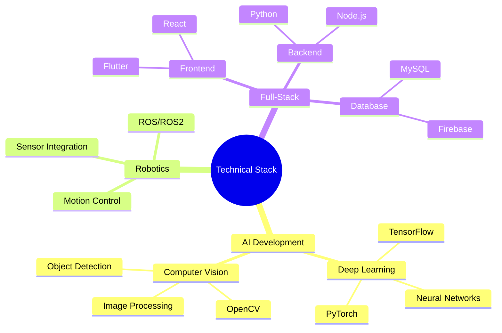
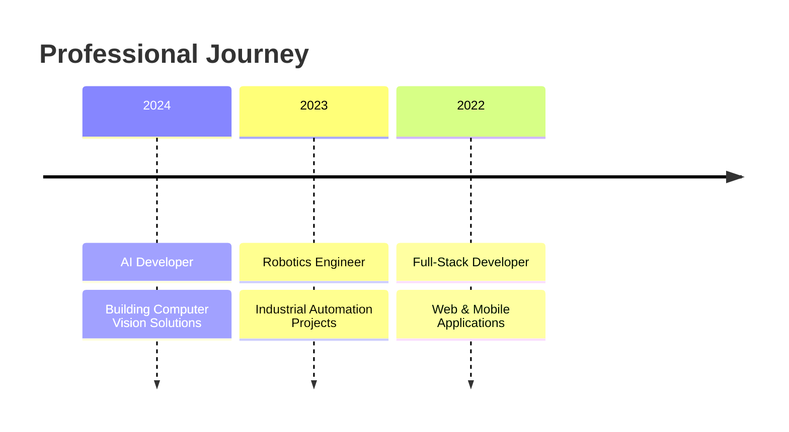

<!-- Dynamic Header Animation -->
<div align="center">
  
</div>

<!-- Profile Image with Neural Network Effect -->
<div align="center">
  
</div>

<!-- Dynamic Typing Effect -->
<div align="center">
  <a href="https://git.io/typing-svg">
    
  </a>
</div>

<!-- Professional Badges -->
<div align="center">
  <a href="your_linkedin_url">
    
  </a>
  <a href="your_portfolio_url">
    
  </a>
  <a href="mailto:your.email@domain.com">
    
  </a>
</div>

<!-- Technology Stack Animation -->
<div align="center">
  
</div>

<!-- Core Skills Visualization -->


<!-- Professional Profile -->
<details open>
<summary><h2>👨‍💻 Professional Profile</h2></summary>

```python
class AIRoboticsDeveloper:
    def __init__(self):
        self.name = "Mohamed Sallam"
        self.role = "AI & Robotics Developer"
        self.tech_stack = {
            "ai_ml": [
                "TensorFlow", "PyTorch", "OpenCV",
                "Scikit-learn", "YOLO", "Neural Networks"
            ],
            "robotics": [
                "ROS/ROS2", "Arduino", "Raspberry Pi",
                "Motor Control", "Sensor Integration"
            ],
            "development": {
                "languages": ["Python", "C++", "JavaScript"],
                "frameworks": ["React", "Flutter", "Node.js"],
                "tools": ["Git", "Docker", "AWS"]
            }
        }
        self.industry_focus = [
            "Industrial Automation",
            "Computer Vision Systems",
            "Smart Robotics Solutions"
        ]

    def get_professional_summary(self):
        return """
        Experienced developer specializing in AI and robotics solutions
        for real-world applications. Focused on building practical,
        scalable systems that combine cutting-edge AI with robust
        robotics engineering.
        """
```

</details>

<!-- Project Showcase -->
<details>
<summary><h2>🚀 Featured Projects</h2></summary>
<div align="center">

### 1. Autonomous Robot System
<table>
  <tr>
    <td width="60%">
      <h4>Key Features:</h4>
      • Autonomous navigation using ROS2 and custom SLAM implementation<br>
      • Real-time object detection with YOLO and custom CNN models<br>
      • Integration with industrial control systems<br>
      • Remote monitoring and control interface
      <h4>Tech Stack:</h4>
      
      
      
    </td>
    <td width="40%">
      <div align="center">
        
        <br>
        <a href="project_link">
          
        </a>
      </div>
    </td>
  </tr>
</table>

### 2. Smart Vision System
<table>
  <tr>
    <td width="40%">
      <div align="center">
        
        <br>
        <a href="project_link">
          
        </a>
      </div>
    </td>
    <td width="60%">
      <h4>Key Features:</h4>
      • Real-time object detection and tracking<br>
      • Custom-trained neural networks for specific use cases<br>
      • Integration with existing security systems<br>
      • Web-based monitoring interface
      <h4>Tech Stack:</h4>
      
      
      
    </td>
  </tr>
</table>

### 3. Industrial Automation Platform
<table>
  <tr>
    <td width="60%">
      <h4>Key Features:</h4>
      • Automated quality control using computer vision<br>
      • Real-time process optimization with ML<br>
      • Integration with industrial IoT systems<br>
      • Custom dashboard for monitoring and control
      <h4>Tech Stack:</h4>
      
      
      
    </td>
    <td width="40%">
      <div align="center">
        
        <br>
        <a href="project_link">
          
        </a>
      </div>
    </td>
  </tr>
</table>

</div>
</details>

<!-- Technical Skills -->
<details>
<summary><h2>💻 Technical Skills</h2></summary>
<div align="center">

### AI & Computer Vision
| Technology | Proficiency | Industry Applications |
|------------|-------------|---------------------|
| TensorFlow/PyTorch |  | Production ML Models |
| Computer Vision |  | Quality Control, Security |
| ML Deployment |  | Edge Computing, Cloud |

### Robotics & Control
| Technology | Proficiency | Industry Applications |
|------------|-------------|---------------------|
| ROS/ROS2 |  | Robot Development |
| Control Systems |  | Industrial Automation |
| Hardware Integration |  | IoT, Smart Systems |

### Development & DevOps
| Technology | Proficiency | Industry Applications |
|------------|-------------|---------------------|
| Full-Stack Dev |  | Web Applications |
| Docker/K8s |  | Deployment |
| CI/CD |  | Pipeline Automation |

</div>
</details>

<!-- Work Experience -->
<details>
<summary><h2>💼 Work Experience</h2></summary>
<div align="center">



### Key Projects & Achievements
- Developed and deployed 10+ AI solutions for industrial clients
- Implemented robotics systems improving efficiency by 40%
- Created custom computer vision solutions for quality control
- Built scalable web applications for IoT device management

</div>
</details>

<!-- GitHub Stats -->
<h2>📊 Development Activity</h2>
<div align="center">
  <!-- Custom Activity Graph -->
  
</div>

<div align="center">
  
  
</div>

<!-- Connect for Projects -->
<h2 align="center">🤝 Let's Build Something Amazing!</h2>
<div align="center">
  <p>Looking to collaborate on innovative AI and robotics projects?</p>
  <a href="mailto:your.email@domain.com">
    
  </a>
</div>

<!-- Footer -->
<div align="center">
  
</div>

<!-- Visitor Counter -->
<div align="center">
  
</div>
